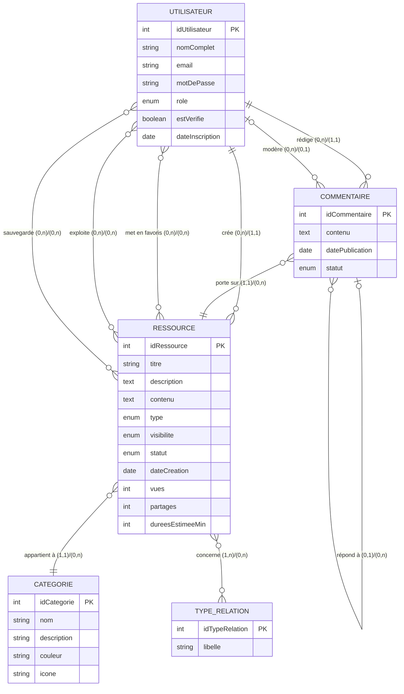

# MCD — (RE)Sources Relationnelles
> Modèle Conceptuel de Données — Notation Merise

---

## Entités et attributs

| Entité | Identifiant | Attributs |
|--------|------------|-----------|
| **UTILISATEUR** | #idUtilisateur | nomComplet, email, motDePasse, role¹, estVerifie, dateInscription |
| **RESSOURCE** | #idRessource | titre, description, contenu, type², visibilite³, statut⁴, dateCreation, vues, partages, dureesEstimeeMin |
| **CATEGORIE** | #idCategorie | nom, description, couleur, icone |
| **TYPE_RELATION** | #idTypeRelation | libelle⁵ |
| **COMMENTAIRE** | #idCommentaire | contenu, datePublication, statut⁶ |

**Légendes :**
- ¹ role : citoyen | modérateur | admin | super-admin
- ² type : article | vidéo | audio | activité | jeu | podcast | document | lien
- ³ visibilité : privée | partagée | publique
- ⁴ statut ressource : brouillon | en_attente | publié | suspendu
- ⁵ libelle : couple | famille | amis | professionnel | social | soi-même
- ⁶ statut commentaire : en_attente | approuvé | rejeté

---

## Associations et cardinalités

```
UTILISATEUR ──(0,n)── CRÉE ──(1,1)── RESSOURCE
```
> Un utilisateur peut créer 0 à n ressources.
> Une ressource est créée par exactement 1 utilisateur.

---

```
RESSOURCE ──(1,1)── APPARTIENT_À ──(0,n)── CATEGORIE
```
> Une ressource appartient à exactement 1 catégorie.
> Une catégorie peut contenir 0 à n ressources.

---

```
RESSOURCE ──(1,n)── CONCERNE ──(0,n)── TYPE_RELATION
```
> Une ressource concerne au moins 1 type de relation.
> Un type de relation peut concerner 0 à n ressources.

---

```
UTILISATEUR ──(0,n)── RÉDIGE ──(1,1)── COMMENTAIRE
```
> Un utilisateur peut rédiger 0 à n commentaires.
> Un commentaire est rédigé par exactement 1 utilisateur.

---

```
COMMENTAIRE ──(1,1)── PORTE_SUR ──(0,n)── RESSOURCE
```
> Un commentaire porte sur exactement 1 ressource.
> Une ressource peut recevoir 0 à n commentaires.

---

```
COMMENTAIRE ──(0,1)── RÉPOND_À ──(0,n)── COMMENTAIRE
```
> Un commentaire peut répondre à 0 ou 1 commentaire parent (association réflexive).
> Un commentaire peut avoir 0 à n réponses.

---

```
UTILISATEUR ──(0,n)── MET_EN_FAVORIS ──(0,n)── RESSOURCE
                       [dateAjout]
```
> Un utilisateur peut mettre en favoris 0 à n ressources.
> Une ressource peut être mise en favoris par 0 à n utilisateurs.

---

```
UTILISATEUR ──(0,n)── EXPLOITE ──(0,n)── RESSOURCE
                       [dateExploitation]
```
> Un utilisateur peut marquer 0 à n ressources comme exploitées.
> Une ressource peut être exploitée par 0 à n utilisateurs.

---

```
UTILISATEUR ──(0,n)── SAUVEGARDE ──(0,n)── RESSOURCE
                       [dateSauvegarde]
```
> Un utilisateur peut sauvegarder 0 à n ressources.
> Une ressource peut être sauvegardée par 0 à n utilisateurs.

---

```
UTILISATEUR ──(0,n)── MODÈRE ──(0,1)── COMMENTAIRE
                       [dateModeration, decision]
```
> Un modérateur peut modérer 0 à n commentaires.
> Un commentaire est modéré par 0 ou 1 modérateur.

---

## Diagramme Mermaid (visualisable sur mermaid.live)



---

## Règles de gestion métier

- Un **citoyen non connecté** peut uniquement consulter les ressources publiques.
- Un **citoyen connecté** peut créer des ressources et commenter.
- Une ressource créée par un citoyen passe par le statut `en_attente` avant publication.
- Seul un **modérateur** peut approuver/rejeter les commentaires et les ressources.
- Seul un **administrateur** peut gérer les catégories et désactiver des comptes.
- Seul le **super-administrateur** peut créer des comptes modérateur/admin.
- Les associations MET_EN_FAVORIS, EXPLOITE et SAUVEGARDE sont propres à chaque utilisateur.
